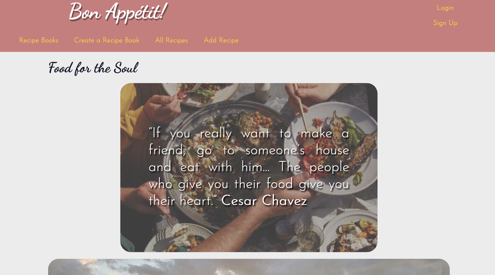
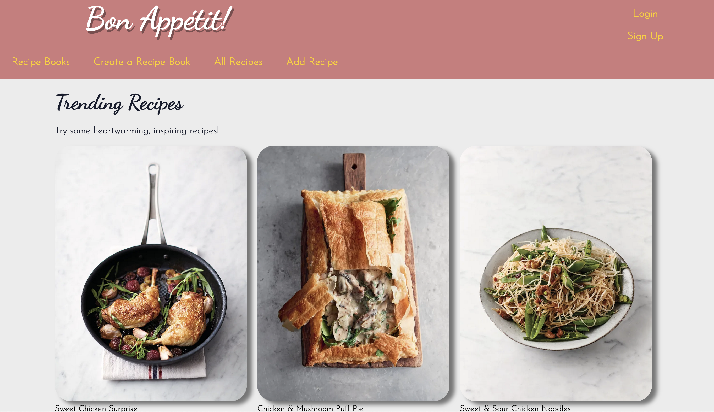
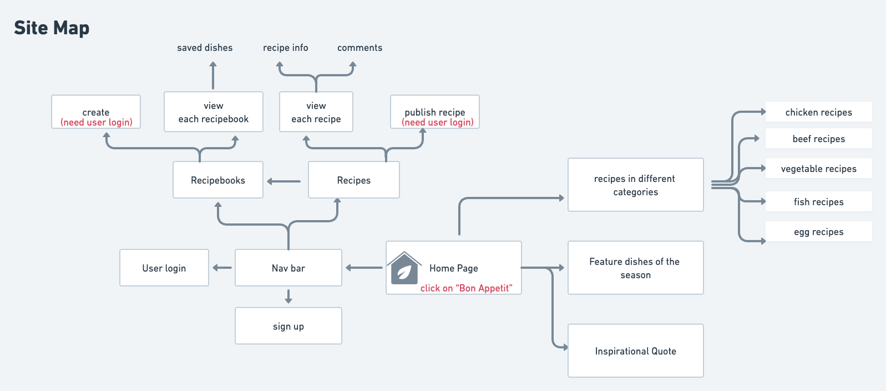
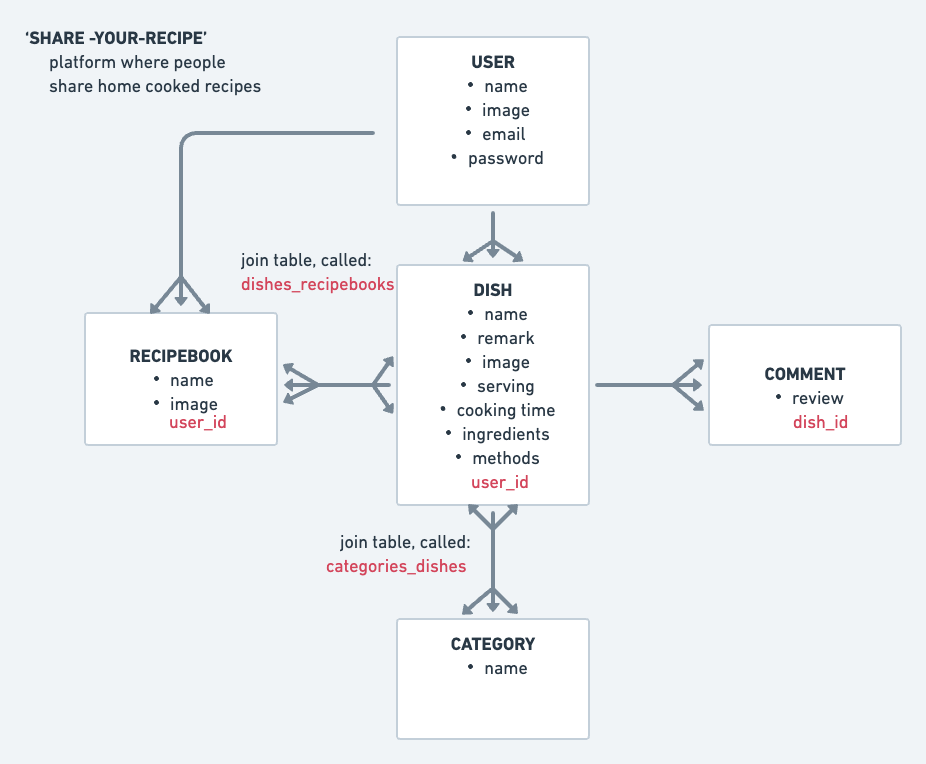

____________________________

# Share a recipe !

link to my webpage - [Bon Appepip](https://bonappepip.herokuapp.com/)!
### Overview of webpage 




>  To quote from Winona LaDuke, “Food for us comes from our relatives, whether they have wings or fins or roots. That is how we consider food. Food has a culture. It has a history. It has a story. It has relationships.”

### Bon Appetit

It's not uncommon to hear people mentioning about their grandma's recipes and or family recipe. However they are not often shared. 

Bon Appetit is a platform where people gather to find and share home cooked recipes where they have been tried, tested and ready to share it to the world with pride! 

### Login Details

```
email: gordon@gmail.com
password: chicken

```

### Site Map


### Behind the Scenes
Welcome to my second individual project for General Assembly Software Engineering Immersive Course. 

We were given a week to build a full-stack application with Rails app applying what we have learnt in the last 2 weeks about the back end development. 

### Project Features
#### Object Model Associations 


#### Tools Used 

> * Ruby on Rails
> * SCSS & CSS
> * HTML & ERB
> * Heroku
> * Cloudinary

#### Wish List 

> * biodata to user's profile
> * 'like' button
> * search bar 
> * image model so users can upload more pictures
> * More main ingredients to the category model
> * more nested categories - vegan, gluten free, vegetarian, keto
> * Other models such as like baking,drinks etc. 

---
#### Issues
Due to time constraint, no issues are detected yet. TBA. 

---

#### Process 
- ~~Delete meal from recipe book~~
- ~~Prevent duplicate meals from being added to recipe book~~
- ~~send error message~~
- ~~Tidy recipe's paragraph~~
- ~~you may also like section in show page~~
- ~~profile icon next to user in recipe book /dish show page~~
- ~~link to youtube to website~~
- ~~add seed: all dishes and recipebooks~~
- ~~users show page~~
- ~~dish show page needs more love~~
- ~~read me - add html link!~~
- css (80%)
